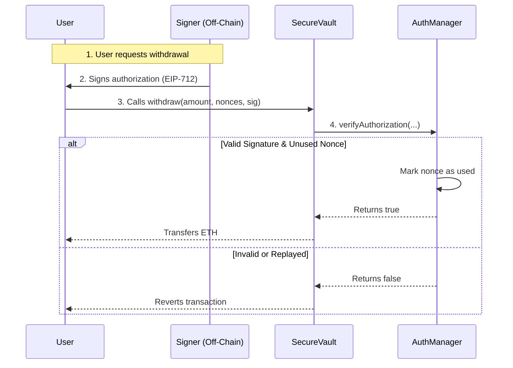

# Secure Vault System

A decentralized system separating asset custody (`SecureVault`) from permission validation (`AuthorizationManager`), verifying permissions via EIP-712 signatures.

## Architecture

The system consists of two primary contracts:

1.  **AuthorizationManager**:
    -   Validates EIP-712 signatures.
    -   Prevents replay attacks using a nonce mapping (`usedNonces`).
    -   Tracks the authorized `signer` (e.g., an off-chain backend or admin).
    -   Returns `true` only if the signature matches the parameters and the nonce is unused.

2.  **SecureVault**:
    -   Holds funds (ETH).
    -   Accepts deposits from any source.
    -   Allows withdrawals **only** if `AuthorizationManager.verifyAuthorization(...)` returns true.
    -   Ensures authorized parameters (recipient, amount, etc.) match the execution context.

### Interaction Flow



## Prerequisites

-   Docker & Docker Compose
-   Node.js (for local development/testing)

## Usage

### Start the System

To start the local blockchain and deploy contracts:

```bash
docker-compose up
```

This will:
1.  Start a Hardhat node on port `8545`.
2.  Deploy the contracts to the local network.
3.  Output the `AuthorizationManager` and `SecureVault` addresses in the logs.

### Testing Locally

You can also run the system tests directly with Node.js:

```bash
npm install
npx hardhat test tests/system.spec.js
```

## Security & Replay Protection

-   **EIP-712 Typed Data**: Ensures the user sees exactly what they are signing. The domain is bound to the `chain.id` and the `AuthorizationManager` address (`verifyingContract`), preventing cross-chain or cross-contract replay.
-   **Nonce Tracking**: The `AuthorizationManager` maintains a `usedNonces` mapping. Once a nonce is used in `verifyAuthorization`, it cannot be used again.
-   **Parameter Binding**: The `SecureVault` calls `verifyAuthorization` with `msg.sender` (passed as recipient context) or explicit parameters to ensure the signature authorizes *this specific* withdrawal action.
-   **Check-Effects-Interactions**: The `usedNonces` state is updated *before* returning success to the Vault, and the Vault checks the return value *before* transferring funds.

## Assumptions & Limitations

-   **Signer Security**: The security of the system depends entirely on the private key of the authorized `signer`. If compromised, the attacker can generate valid withdrawal signatures.
-   **Nonce Management**: The off-chain system must manage unique nonces. Collisions will result in failed legitimate withdrawals.
-   **Gas Costs**: On-chain verification and state updates (writing to `usedNonces`) incur gas usage for every withdrawal.
